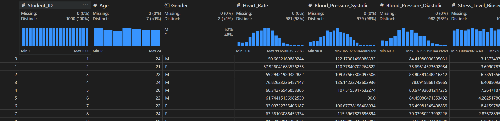

# Student Health
Student Health Risk model is my project for Machine Learning Zoomcamp 2024. This project implements all the learned in the course.

# Problem description

In high-stress environments such as academic and entrepreneurial settings, college students often face significant health risks. These risks can be physiological, psychological, or a combination of both, and they can severely impact students' overall well-being and academic performance.

### Key Factors:

1. **Demographic Information**: Age, gender, and unique student identifiers.

2. **Physiological Data**: Real-time biosensor metrics, including heart rate, blood pressure (systolic and diastolic), and stress levels.

3. **Psychological Data**: Self-reported stress levels and mood states.

4. **Academic & Entrepreneurial Activity**: Hours spent on academic tasks and entrepreneurial projects.

5. **Physical Activity & Sleep Quality**: Measures of daily physical activity and sleep quality.

6. **Health Risk Level**: A target label indicating low, moderate, or high health risk, derived from combinations of physiological and psychological metrics.

**Objective**: The goal is to develop and test machine learning models that can predict occupational health risks, such as stress and physical strain, among college students. By accurately assessing these risks, interventions can be designed to improve students' health and academic performance.

# Dataset
The dataset was found as a [Kaggle](https://www.kaggle.com/datasets/ziya07/student-health-data/data) dataset. Sample data:



This file, student_health_data.csv, contains data for assessing health risks among college students involved in academic and entrepreneurial activities. The data is structured to support machine learning models that predict health conditions related to stress, physical strain, and mental well-being. Each row represents an individual student’s health, workload, and lifestyle characteristics.

### Attribute Information

- **Student\_ID**: Unique identifier for each student.  
- **Age and Gender**: Demographic information relevant to physiological data interpretation.  
- **Heart\_Rate, Blood\_Pressure\_Systolic, Blood\_Pressure\_Diastolic**: Physiological measurements gathered from biosensors, indicative of cardiovascular health.  
- **Stress\_Level\_Biosensor and Stress\_Level\_Self\_Report**: Biosensor and self-reported stress levels on a scale of 1 to 10.  
- **Physical\_Activity and Sleep\_Quality**: Categorical variables indicating physical activity level (Low, Moderate, High) and sleep quality (Poor, Moderate, Good).  
- **Mood**: Self-reported emotional state categorized as 'Happy', 'Neutral', or 'Stressed'.  
- **Study\_Hours and Project\_Hours**: Weekly hours dedicated to study and entrepreneurial activities, which are major factors contributing to workload.  
- **Health\_Risk\_Level**: Target label derived based on stress and lifestyle indicators, categorized as Low, Moderate, or High risk.

## Project directories

- **DATASET**
    - It contains the dataset.
- **docker-images**
    - It contains the docker file for deploying the service.
- **student-health-predictor-service**
    - Contains code for deply the service.
- **IaC**
    - It contains the terraform files for deploy the infrastructure on AWS. Also, how deploy the infrastructure.
- **models**
    - It contains the models generated by the notebooks.
- **notebooks**
    - It contains jupyter notebooks.

`images` directory only contains the images for the markdown.

# Notebooks

- **exploratory-data-analysis.ipynb**
    - This notebook contains exploratory data analysis.
- **train_model.ipynb**
    - This notebook contains preprocessing, training and saving model.
- **train.py**
    - Train models and saves.

# Reproducibility

## Local manually

1. Build docker image
    ```sh
    docker build -t student-api -f .\docker-images\health.Dockerfile .
    ```
2. Run Makefile
    ```docker
        docker run -it \
            --rm \
            --name health-student-predictor \
            -p 9696:9696 \
            student-api
    ```

## Local with scripts

1. Build docker image
    ```sh
    scripts/start-local.sh
    ```

## AWS

1. cd `IaC`
2. Copy `sample.vars.tfvars` to `vars.tfvars`
3. Configure `vars.tfvars`
4. Configure you AWS Credentials with `aws configure`. (If you don´t have installed AWS CLI, you need install it with `pip install awscli`)
5. Run Makefile
6. Execute `make deploy_aws`
7. Execute:
    ```sh
        # Authenticate in ECR
        aws ecr get-login-password --region us-east-1 | docker login --username AWS --password-stdin $(terraform output -raw ecr_repository_url)

        # Build the image
        docker build -t student-api .

        # Tag the image
        docker tag student-api:latest $(terraform output -raw ecr_repository_url):latest

        # Upload the image
        docker push $(terraform output -raw ecr_repository_url):latest
    ```


# Testing Endpoint

Sample json files are in `student-health-predictor-service/tests`.

Call Endpoint
```bash
curl -X POST -H "Content-Type: application/json" -d @sample_low.json localhost:9696/predict
```

Response

```json
{
    "heart_failure_risk": "Low"
}
```

Test Endpoint in AWS

```sh
#!/bin/bash

# Obtener el DNS del ALB (asumiendo que ya ejecutaste terraform output)
ALB_DNS=$(terraform output -raw alb_dns_name)

# Datos de ejemplo para la predicción
PATIENT_DATA='{
    "Heart_Rate": 83.14009474643899,
    "Blood_Pressure_Systolic": 111.40691865693377,
    "Blood_Pressure_Diastolic": 80.99138339418124,
    "Stress_Level_Biosensor": 9.658526490472164,
    "Stress_Level_Self_Report": 6.445914600134357,
    "Study_Hours": 28.497479759833432,
    "Project_Hours": 11.690317956183122,
    "Health_Risk_Level": ""
}'

# Verificar que el servicio está funcionando
echo "Verificando el estado del servicio..."
curl -X GET http://${ALB_DNS}/health

# Realizar una predicción
echo -e "\nRealizando predicción..."
curl -X POST \
    -H "Content-Type: application/json" \
    -d "${PATIENT_DATA}" \
    http://${ALB_DNS}/predict
```